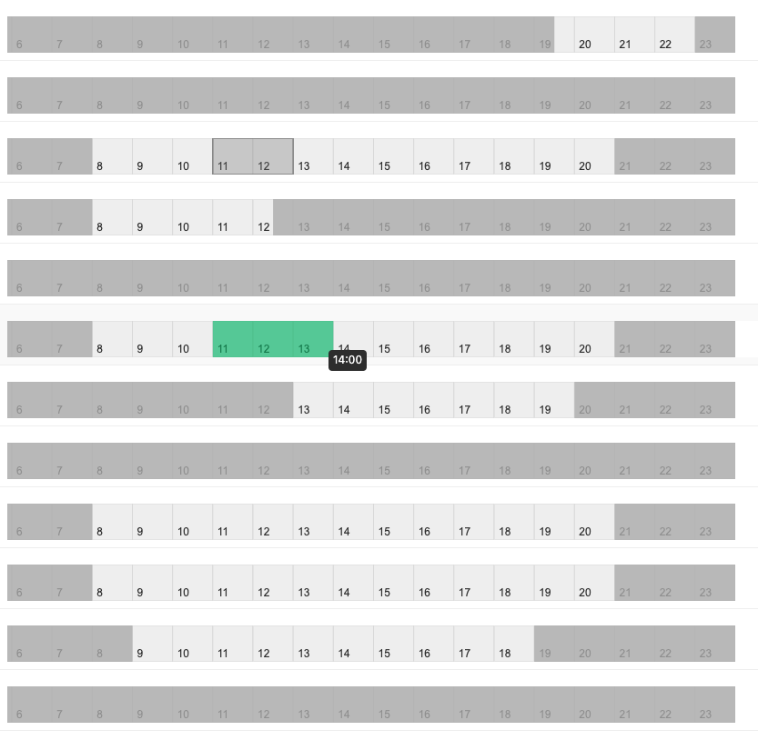

# Vue Time Bar ⏱️

A time block selection component based on Canvas, designed for Vue 3 + Ant Design Vue. It supports interactive time range selection, dragging, and right-click deletion.



## ✨ Features

- Time block selection in 30-minute increments
- Right-click to delete selected time blocks
- Read-only display mode
- Display reserved and unavailable time blocks (extensible)

## 🚀 Usage Example

```vue
<template>
  <TimeBar v-model:value="timeItems" :defaultValue="[]" />
</template>

<script setup lang="ts">
import TimeBar from 'vue-time-bar';
import { ref } from 'vue';

const timeItems = ref([]);
</script>
```

## 📘 Props

| Prop             | Type          | Description                         |
|------------------|---------------|-------------------------------------|
| value / v-model  | TimeBarItems  | Selected time blocks                |
| defaultValue     | TimeBarItems  | Initial time blocks                 |
| readonly         | boolean       | Read-only mode                      |
| reservedTimes    | TimeBarItems  | Reserved (already booked) times     |
| unavailableTimes | TimeBarItems  | Unavailable time blocks             |
```ts
[
  { start: "09:00", end: "10:00" },
  { start: "14:00", end: "15:30" }
]
```

```
vue-time-bar/
├── src/
│   └── components/TimeBar.vue         
├── examples/                         
│   └── App.vue                        
├── index.ts                           
├── package.json
├── tsconfig.json
├── vite.config.ts
└── README.md
```

## 📜 License

[MIT](./LICENSE)